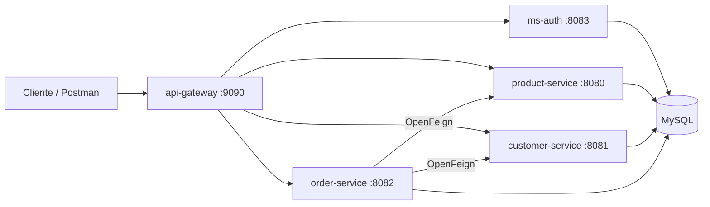

# NovaShop

Backend de e-commerce en microservicios. El cliente habla solo con el **API Gateway**; detrás hay servicios de catálogo, clientes, pedidos y autenticación JWT, cada uno con su propia base MySQL.

Punto de entrada:

```text
http://localhost:9090
```

## Requisitos

- [Git](https://git-scm.com/)
- [Docker](https://docs.docker.com/get-docker/) y [Docker Compose](https://docs.docker.com/compose/)
- [Java 25](https://adoptium.net/) (solo si corrés los servicios fuera de Docker)
- Maven Wrapper incluido en cada módulo (`./mvnw`)

## Clonar el repositorio

```bash
git clone https://github.com/pablophdev/NovaShop.git
cd NovaShop
```

## Cómo funciona



1. El gateway valida JWT (salvo login, register y GET de catálogo) y enruta por path.
2. `ms-auth` registra usuarios, autentica y emite tokens Bearer.
3. `product-service` administra categorías, productos y stock.
4. `customer-service` administra clientes.
5. `order-service` crea y cancela pedidos: valida cliente y producto, calcula totales y actualiza stock vía Feign.

Cada servicio usa su schema (`db_products`, `db_customers`, `db_orders`, `db_auth`). El esquema lo aplica **Liquibase** al arrancar (`ddl-auto=validate`).

En Docker Compose, MySQL **no** se publica al host: solo el gateway escucha en `9090`.

## Puertos

| Servicio | Puerto | Base | Expuesto en Compose |
| --- | --- | --- | --- |
| `api-gateway` | `9090` | — | Sí (`9090:9090`) |
| `product-service` | `8080` | `db_products` | No (red interna) |
| `customer-service` | `8081` | `db_customers` | No |
| `order-service` | `8082` | `db_orders` | No |
| `ms-auth` | `8083` | `db_auth` | No |
| MySQL 8.4 | `3306` (interno) | — | No |

Rutas del gateway:

| Path | Destino |
| --- | --- |
| `/api/products/**`, `/api/categories/**` | `product-service` |
| `/api/customers/**` | `customer-service` |
| `/api/orders/**` | `order-service` |
| `/api/auth/**` | `ms-auth` |

## Arranque rápido (recomendado)

```bash
cp .env.example .env
```

Editá `.env` y definí al menos:

```env
MYSQL_ROOT_PASSWORD=una-password-local-segura
JWT_SECRET=un-secreto-de-al-menos-32-caracteres
JWT_EXPIRATION=3600000
```

`JWT_SECRET` debe ser el mismo para `ms-auth` y `api-gateway` (mínimo 32 caracteres, HS256).

```bash
docker compose up --build
```

La primera vez Maven descarga dependencias dentro de cada imagen: puede tardar varios minutos. Cuando el gateway esté healthy:

```bash
curl http://localhost:9090/api/products
curl http://localhost:9090/actuator/health
```

Parar:

```bash
docker compose down
```

Borrar también el volumen de MySQL:

```bash
docker compose down -v
```

Logs y estado:

```bash
docker compose ps
docker compose logs -f api-gateway
```

## Probar la API

Todas las llamadas de ejemplo van al gateway (`http://localhost:9090`). Incluí `Content-Type: application/json` en POST/PUT/PATCH.

### 1. Registro y login

```bash
curl -s -X POST http://localhost:9090/api/auth/register \
  -H "Content-Type: application/json" \
  -d '{
    "email": "pedro@example.com",
    "password": "secret12",
    "firstName": "Pedro",
    "lastName": "Perez"
  }'
```

```bash
curl -s -X POST http://localhost:9090/api/auth/login \
  -H "Content-Type: application/json" \
  -d '{
    "email": "pedro@example.com",
    "password": "secret12"
  }'
```

Guardá el `token` de la respuesta. El registro asigna rol `USER`.

```bash
export TOKEN="<pegar-token>"
```

Usuario actual:

```bash
curl -s http://localhost:9090/api/auth/me \
  -H "Authorization: Bearer $TOKEN"
```

### 2. Catálogo (público en lectura)

```bash
curl -s http://localhost:9090/api/categories
curl -s http://localhost:9090/api/products
```

Crear categoría o producto exige rol `ADMIN`. Un `USER` recibe `403`.

### 3. Cliente y pedido (usuario autenticado)

```bash
curl -s -X POST http://localhost:9090/api/customers \
  -H "Authorization: Bearer $TOKEN" \
  -H "Content-Type: application/json" \
  -d '{
    "firstName": "Pedro",
    "lastName": "Perez",
    "email": "pedro.cliente@example.com",
    "phone": "+5491123456789",
    "address": "Av. Siempre Viva 123",
    "active": true
  }'
```

```bash
curl -s -X POST http://localhost:9090/api/orders \
  -H "Authorization: Bearer $TOKEN" \
  -H "Content-Type: application/json" \
  -d '{
    "customerId": 1,
    "items": [{ "productId": 1, "quantity": 2 }]
  }'
```

Cancelar:

```bash
curl -s -X PATCH http://localhost:9090/api/orders/1/cancel \
  -H "Authorization: Bearer $TOKEN"
```

Listar todos los clientes o pedidos exige `ADMIN`.

### Acceso por rol (gateway)

| Recurso | Público | Autenticado | `ADMIN` |
| --- | --- | --- | --- |
| `POST /api/auth/register`, `POST /api/auth/login` | Sí | | |
| `GET /api/products/**`, `GET /api/categories/**` | Sí | | |
| `GET /api/auth/me` | | Sí | |
| `POST/PUT /api/customers/**`, `GET /api/customers/{id}` | | Sí | |
| `POST /api/orders`, `GET /api/orders/{id}`, `PATCH .../cancel` | | Sí | |
| Mutaciones de productos y categorías | | | Sí |
| `GET /api/customers`, `DELETE /api/customers/**` | | | Sí |
| `GET /api/orders` | | | Sí |

### Postman

Colecciones en `postman/`:

- `postman/ms-auth/ms-auth.postman_collection.json`
- `postman/product-service/product-service.postman_collection.json`
- `postman/customer-service/customer-service.postman_collection.json`
- `postman/order-service/order-service.postman_collection.json`

Para el stack en Docker, usá base URL `http://localhost:9090`. Las colecciones también sirven contra cada servicio en local (`8080`–`8083`) si los levantás fuera de Compose.

## Tests

Cada módulo trae Maven Wrapper. Desde la raíz:

```bash
./product-service/mvnw -f product-service/pom.xml test
./customer-service/mvnw -f customer-service/pom.xml test
./order-service/mvnw -f order-service/pom.xml test
./ms-auth/mvnw -f ms-auth/pom.xml test
./api-gateway/mvnw -f api-gateway/pom.xml test
```

Hoy los tests son de contexto Spring (`contextLoads`). Los servicios con JPA esperan MySQL disponible; si no hay base, el test de contexto falla.

Compilar sin tests:

```bash
./product-service/mvnw -f product-service/pom.xml -DskipTests package
```

## Desarrollo local (sin Compose para las apps)

Hace falta un MySQL en `localhost:3306` (Compose **no** publica `3306`). Creá las bases:

```sql
CREATE DATABASE db_products CHARACTER SET utf8mb4 COLLATE utf8mb4_unicode_ci;
CREATE DATABASE db_customers CHARACTER SET utf8mb4 COLLATE utf8mb4_unicode_ci;
CREATE DATABASE db_orders CHARACTER SET utf8mb4 COLLATE utf8mb4_unicode_ci;
CREATE DATABASE db_auth CHARACTER SET utf8mb4 COLLATE utf8mb4_unicode_ci;
```

Variables mínimas (mismo `JWT_SECRET` en auth y gateway):

| Variable | Uso |
| --- | --- |
| `DB_URL`, `DB_USERNAME`, `DB_PASSWORD` | JDBC de cada servicio |
| `JWT_SECRET`, `JWT_EXPIRATION` | `ms-auth` y `api-gateway` |
| `CUSTOMER_SERVICE_URL`, `PRODUCT_SERVICE_URL` | `order-service` |
| `PRODUCT_SERVICE_URI`, `CUSTOMER_SERVICE_URI`, `ORDER_SERVICE_URI`, `AUTH_SERVICE_URI` | `api-gateway` |

Hay launch configs en `.vscode/launch.json`. Orden sugerido: MySQL → product, customer, ms-auth → order → gateway.

```bash
cd product-service && ./mvnw spring-boot:run
```

Documentación por servicio:

- [product-service/README.md](product-service/README.md)
- [customer-service/README.md](customer-service/README.md)
- [order-service/README.md](order-service/README.md)

## Estructura

```text
NovaShop/
├── api-gateway/          Spring Cloud Gateway + JWT
├── ms-auth/              Registro, login, JWT
├── product-service/      Catálogo y categorías
├── customer-service/     Clientes
├── order-service/        Pedidos + Feign
├── docker/mysql/init/    CREATE DATABASE al primer arranque
├── postman/              Colecciones de prueba
├── docker-compose.yml
└── .env.example
```

Stack: Java 25, Spring Boot 4.0.8, Spring Cloud 2025.1.3, Spring Data JPA, Liquibase, OpenFeign, JJWT, MySQL 8.4.

## Health

| URL | Cuándo |
| --- | --- |
| `GET http://localhost:9090/actuator/health` | Stack con Compose |
| `GET http://localhost:8080/actuator/health` | product-service en local |
| `GET http://localhost:8081/actuator/health` | customer-service en local |
| `GET http://localhost:8082/actuator/health` | order-service en local |
| `GET http://localhost:8083/actuator/health` | ms-auth en local |

Respuesta esperada: `{ "status": "UP" }`.
