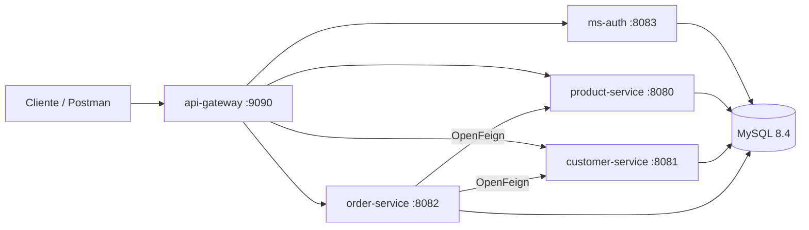

# NovaShop

Backend de e-commerce construido con microservicios en Java y Spring Boot. La aplicación expone un único punto de entrada, `api-gateway`, y detrás separa autenticación, catálogo, clientes y pedidos en servicios independientes.

URL principal en desarrollo:

```text
http://localhost:9090
```

## Tabla De Contenido

- [Arquitectura](#arquitectura)
- [Tecnologías](#tecnologías)
- [Requisitos](#requisitos)
- [Arranque Rápido](#arranque-rápido)
- [Servicios Y Puertos](#servicios-y-puertos)
- [Variables De Entorno](#variables-de-entorno)
- [Endpoints Principales](#endpoints-principales)
- [Autenticación Y Roles](#autenticación-y-roles)
- [Postman](#postman)
- [Tests Y Build](#tests-y-build)
- [Desarrollo Local Sin Docker](#desarrollo-local-sin-docker)
- [Troubleshooting](#troubleshooting)

## Arquitectura

NovaShop está dividido en cinco aplicaciones Spring Boot:

| Servicio | Responsabilidad |
| --- | --- |
| `api-gateway` | Entrada pública. Enruta peticiones y aplica seguridad JWT. |
| `ms-auth` | Registro, login, generación de JWT y datos del usuario autenticado. |
| `product-service` | Gestión de productos, categorías y stock. |
| `customer-service` | Gestión de clientes. |
| `order-service` | Gestión de pedidos. Valida clientes/productos y actualiza stock usando clientes HTTP. |

Cada servicio de negocio tiene su propia base de datos dentro del mismo MySQL:

| Base de datos | Servicio |
| --- | --- |
| `db_auth` | `ms-auth` |
| `db_products` | `product-service` |
| `db_customers` | `customer-service` |
| `db_orders` | `order-service` |



Flujo típico:

1. El cliente se registra o inicia sesión en `/api/auth`.
2. `ms-auth` emite un token JWT.
3. El cliente envía el token al gateway con `Authorization: Bearer <token>`.
4. El gateway valida el token, revisa el rol y redirige la petición al servicio correcto.
5. `order-service` consulta clientes/productos antes de confirmar pedidos y descontar stock.

## Tecnologías

- Java 25
- Spring Boot 4.0.8
- Spring Cloud Gateway WebFlux
- Spring Cloud OpenFeign
- Spring Security
- JWT con JJWT
- Spring Data JPA
- Liquibase
- MySQL 8.4
- Docker y Docker Compose
- Maven Wrapper por servicio

## Requisitos

- Git
- Docker y Docker Compose
- Java 25 solo si vas a ejecutar servicios fuera de Docker

No necesitas instalar Maven globalmente: cada servicio incluye `mvnw`.

## Arranque Rápido

1. Clona el repositorio:

```bash
git clone https://github.com/pablophdev/NovaShop.git
cd NovaShop
```

2. Crea el archivo de entorno:

```bash
cp .env.example .env
```

3. Edita `.env` y define, como mínimo:

```env
MYSQL_ROOT_PASSWORD=una-clave-local-segura
JWT_SECRET=un-secreto-de-al-menos-32-caracteres
JWT_EXPIRATION=3600000
```

`JWT_SECRET` debe ser el mismo para `ms-auth` y `api-gateway`. Usa al menos 32 caracteres para evitar errores de firma JWT.

4. Levanta todo el stack:

```bash
docker compose up --build
```

5. Comprueba el gateway:

```bash
curl http://localhost:9090/actuator/health
```

Respuesta esperada:

```json
{"status":"UP"}
```

Comandos útiles:

```bash
docker compose ps
docker compose logs -f api-gateway
docker compose down
docker compose down -v
```

`docker compose down -v` elimina también los datos persistidos de MySQL.

## Servicios Y Puertos

Con Docker Compose solo se publica el gateway en tu máquina. Los demás servicios y MySQL viven en la red interna de Docker.

| Servicio | Puerto interno | Base de datos | Publicado en Compose |
| --- | ---: | --- | --- |
| `api-gateway` | `9090` | N/A | Sí, `localhost:9090` |
| `product-service` | `8080` | `db_products` | No |
| `customer-service` | `8081` | `db_customers` | No |
| `order-service` | `8082` | `db_orders` | No |
| `ms-auth` | `8083` | `db_auth` | No |
| `mysql` | `3306` | Todas | No |

Rutas del gateway:

| Ruta | Servicio destino |
| --- | --- |
| `/api/auth/**` | `ms-auth` |
| `/api/products/**` | `product-service` |
| `/api/categories/**` | `product-service` |
| `/api/customers/**` | `customer-service` |
| `/api/orders/**` | `order-service` |

## Variables De Entorno

Variables principales del proyecto:

| Variable | Uso |
| --- | --- |
| `MYSQL_ROOT_PASSWORD` | Password root del MySQL usado por Docker Compose. |
| `DB_URL` | URL JDBC de cada servicio cuando se ejecuta localmente. |
| `DB_USERNAME` | Usuario de base de datos. |
| `DB_PASSWORD` | Password de base de datos. |
| `JWT_SECRET` | Secreto compartido por `ms-auth` y `api-gateway`. |
| `JWT_EXPIRATION` | Duración del token JWT en milisegundos. |
| `PRODUCT_SERVICE_URI` | Destino del gateway para productos. |
| `CUSTOMER_SERVICE_URI` | Destino del gateway para clientes. |
| `ORDER_SERVICE_URI` | Destino del gateway para pedidos. |
| `AUTH_SERVICE_URI` | Destino del gateway para autenticación. |
| `PRODUCT_SERVICE_URL` | URL usada por `order-service` para consultar productos. |
| `CUSTOMER_SERVICE_URL` | URL usada por `order-service` para consultar clientes. |

Las bases se crean al iniciar MySQL desde `docker/mysql/init/01-create-databases.sql`. Las tablas las gestiona Liquibase en cada servicio.

## Endpoints Principales

Todos los ejemplos usan el gateway: `http://localhost:9090`.

### Autenticación

| Método | Endpoint | Acceso | Descripción |
| --- | --- | --- | --- |
| `POST` | `/api/auth/register` | Público | Registra un usuario y devuelve token. |
| `POST` | `/api/auth/login` | Público | Inicia sesión y devuelve token. |
| `GET` | `/api/auth/me` | Autenticado | Devuelve el usuario del token. |

Registrar usuario:

```bash
curl -s -X POST http://localhost:9090/api/auth/register \
  -H "Content-Type: application/json" \
  -d '{
    "email": "pedro@example.com",
    "password": "secret12",
    "firstName": "Pedro",
    "lastName": "Perez"
  }'
```

Login:

```bash
curl -s -X POST http://localhost:9090/api/auth/login \
  -H "Content-Type: application/json" \
  -d '{
    "email": "pedro@example.com",
    "password": "secret12"
  }'
```

Guardar token:

```bash
export TOKEN="pega-aqui-el-token"
```

Consultar usuario actual:

```bash
curl -s http://localhost:9090/api/auth/me \
  -H "Authorization: Bearer $TOKEN"
```

### Catálogo

Lectura pública:

```bash
curl -s http://localhost:9090/api/categories
curl -s http://localhost:9090/api/products
curl -s "http://localhost:9090/api/products/search?name=camisa"
```

| Método | Endpoint | Acceso |
| --- | --- | --- |
| `GET` | `/api/products` | Público |
| `GET` | `/api/products/{id}` | Público |
| `GET` | `/api/products/sku/{sku}` | Público |
| `GET` | `/api/products/search?name=...` | Público |
| `POST` | `/api/products` | `ADMIN` |
| `PUT` | `/api/products/{id}` | `ADMIN` |
| `PATCH` | `/api/products/{id}/stock` | `ADMIN` |
| `DELETE` | `/api/products/{id}` | `ADMIN` |
| `GET` | `/api/categories` | Público |
| `GET` | `/api/categories/{id}` | Público |
| `GET` | `/api/categories/search?name=...` | Público |
| `POST` | `/api/categories` | `ADMIN` |
| `PUT` | `/api/categories/{id}` | `ADMIN` |
| `DELETE` | `/api/categories/{id}` | `ADMIN` |

### Clientes

Crear cliente autenticado:

```bash
curl -s -X POST http://localhost:9090/api/customers \
  -H "Authorization: Bearer $TOKEN" \
  -H "Content-Type: application/json" \
  -d '{
    "firstName": "Pedro",
    "lastName": "Perez",
    "email": "pedro.cliente@example.com",
    "phone": "+56912345678",
    "address": "Av. Providencia 123",
    "active": true
  }'
```

| Método | Endpoint | Acceso |
| --- | --- | --- |
| `GET` | `/api/customers` | `ADMIN` |
| `GET` | `/api/customers/{id}` | Autenticado |
| `POST` | `/api/customers` | Autenticado |
| `PUT` | `/api/customers/{id}` | Autenticado |
| `DELETE` | `/api/customers/{id}` | `ADMIN` |

### Pedidos

Crear pedido:

```bash
curl -s -X POST http://localhost:9090/api/orders \
  -H "Authorization: Bearer $TOKEN" \
  -H "Content-Type: application/json" \
  -d '{
    "customerId": 1,
    "items": [
      { "productId": 1, "quantity": 2 }
    ]
  }'
```

Cancelar pedido:

```bash
curl -s -X PATCH http://localhost:9090/api/orders/1/cancel \
  -H "Authorization: Bearer $TOKEN"
```

| Método | Endpoint | Acceso |
| --- | --- | --- |
| `GET` | `/api/orders` | `ADMIN` |
| `GET` | `/api/orders/{id}` | Autenticado |
| `POST` | `/api/orders` | Autenticado |
| `PATCH` | `/api/orders/{id}/cancel` | Autenticado |

## Autenticación Y Roles

Para rutas protegidas, agrega el JWT en cada petición:

```http
Authorization: Bearer <token>
```

Reglas principales del gateway:

| Recurso | Acceso |
| --- | --- |
| Registro y login | Público |
| Lectura de productos y categorías | Público |
| `/api/auth/me` | Autenticado |
| Crear o modificar clientes | Autenticado |
| Crear, ver o cancelar pedidos | Autenticado |
| Crear, editar o borrar productos/categorías | `ADMIN` |
| Listar todos los clientes o pedidos | `ADMIN` |
| Borrar clientes | `ADMIN` |

Los usuarios creados con `/api/auth/register` quedan con rol `USER` por defecto. Para probar rutas `ADMIN`, el usuario debe tener rol `ADMIN` en la base `db_auth`.

## Postman

El directorio `postman/` contiene colecciones listas para importar:

- `postman/ms-auth/ms-auth.postman_collection.json`
- `postman/product-service/product-service.postman_collection.json`
- `postman/customer-service/customer-service.postman_collection.json`
- `postman/order-service/order-service.postman_collection.json`

Con Docker Compose, usa como base URL:

```text
http://localhost:9090
```

## Tests Y Build

Cada servicio se compila y testea por separado.

Ejecutar tests desde la raíz:

```bash
./product-service/mvnw -f product-service/pom.xml test
./customer-service/mvnw -f customer-service/pom.xml test
./order-service/mvnw -f order-service/pom.xml test
./ms-auth/mvnw -f ms-auth/pom.xml test
./api-gateway/mvnw -f api-gateway/pom.xml test
```

Compilar un servicio sin tests:

```bash
./product-service/mvnw -f product-service/pom.xml -DskipTests package
```

Los tests actuales son principalmente de carga de contexto Spring. Los servicios con JPA requieren una base MySQL disponible si se ejecutan fuera del entorno esperado.

## Desarrollo Local Sin Docker

Para correr servicios desde el IDE o terminal sin Docker Compose, necesitas un MySQL accesible desde tu host. El Compose del proyecto no publica `3306`, así que usa un MySQL local o expón el puerto manualmente.

Crear bases manualmente:

```sql
CREATE DATABASE db_products CHARACTER SET utf8mb4 COLLATE utf8mb4_unicode_ci;
CREATE DATABASE db_customers CHARACTER SET utf8mb4 COLLATE utf8mb4_unicode_ci;
CREATE DATABASE db_orders CHARACTER SET utf8mb4 COLLATE utf8mb4_unicode_ci;
CREATE DATABASE db_auth CHARACTER SET utf8mb4 COLLATE utf8mb4_unicode_ci;
```

Orden recomendado de arranque:

1. MySQL
2. `product-service`, `customer-service` y `ms-auth`
3. `order-service`
4. `api-gateway`

Ejemplo con `product-service`:

```bash
cd product-service
DB_URL=jdbc:mysql://localhost:3306/db_products \
DB_USERNAME=root \
DB_PASSWORD=tu-password \
./mvnw spring-boot:run
```

Hay configuraciones de arranque en `.vscode/launch.json`.

README por servicio:

- [product-service/README.md](product-service/README.md)
- [customer-service/README.md](customer-service/README.md)
- [order-service/README.md](order-service/README.md)

## Estructura Del Repositorio

```text
NovaShop/
├── api-gateway/          # Gateway, rutas y validación JWT
├── ms-auth/              # Autenticación, usuarios y tokens
├── product-service/      # Productos, categorías y stock
├── customer-service/     # Clientes
├── order-service/        # Pedidos e integración entre servicios
├── docker/mysql/init/    # Script inicial de bases MySQL
├── postman/              # Colecciones de prueba
├── docker-compose.yml
└── .env.example
```

## Health Checks

| Contexto | URL |
| --- | --- |
| Stack con Docker Compose | `GET http://localhost:9090/actuator/health` |
| `product-service` local | `GET http://localhost:8080/actuator/health` |
| `customer-service` local | `GET http://localhost:8081/actuator/health` |
| `order-service` local | `GET http://localhost:8082/actuator/health` |
| `ms-auth` local | `GET http://localhost:8083/actuator/health` |

## Troubleshooting

| Problema | Posible causa | Solución |
| --- | --- | --- |
| `JWT_SECRET is required` | Falta la variable en `.env`. | Copia `.env.example` a `.env` y define `JWT_SECRET`. |
| Error al firmar o validar JWT | `JWT_SECRET` demasiado corto o distinto entre servicios. | Usa el mismo secreto de al menos 32 caracteres. |
| `403 Forbidden` al crear productos | El usuario tiene rol `USER`. | Usa un usuario con rol `ADMIN`. |
| No responde `localhost:8080` con Docker Compose | El servicio no está publicado al host. | Consume desde `localhost:9090` a través del gateway. |
| Tests JPA fallan localmente | No hay MySQL disponible o faltan variables `DB_*`. | Levanta MySQL y configura `DB_URL`, `DB_USERNAME` y `DB_PASSWORD`. |
