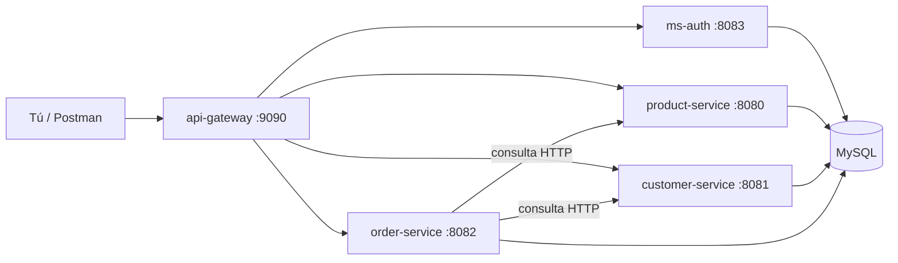

# NovaShop

Backend de una tienda online, armado con **microservicios**.

En la práctica es simple: tu app o Postman habla **solo** con el API Gateway. El resto de servicios (catálogo, clientes, pedidos y login) queda detrás y no se expone al computador.

Dirección principal:

```text
http://localhost:9090
```

## Índice

- [Qué necesitas](#qué-necesitas)
- [Cómo clonar el proyecto](#cómo-clonar-el-proyecto)
- [Cómo está armado](#cómo-está-armado)
- [Puertos](#puertos)
- [Levantar todo con Docker](#levantar-todo-con-docker)
- [Probar la API](#probar-la-api)
- [Quién puede pegarle a cada endpoint](#quién-puede-pegarle-a-cada-endpoint)
- [Postman](#postman)
- [Tests](#tests)
- [Correr los servicios a mano](#correr-los-servicios-a-mano)
- [Carpetas del repo](#carpetas-del-repo)
- [Health check](#health-check)

## Qué necesitas

- [Git](https://git-scm.com/)
- [Docker](https://docs.docker.com/get-docker/) y [Docker Compose](https://docs.docker.com/compose/)
- [Java 25](https://adoptium.net/) solo si quieres correr los servicios **sin** Docker
- Cada módulo ya trae Maven Wrapper (`./mvnw`), no hace falta instalar Maven

## Cómo clonar el proyecto

```bash
git clone https://github.com/pablophdev/NovaShop.git
cd NovaShop
```

## Cómo está armado

Hay cinco aplicaciones Java. Cada una hace una cosa:

| Servicio | Para qué sirve |
| --- | --- |
| `api-gateway` | Recibe todas las peticiones, revisa el token y las deriva al servicio correcto |
| `ms-auth` | Registro, login y emisión del JWT (el token de sesión) |
| `product-service` | Categorías, productos y stock |
| `customer-service` | Ficha de clientes |
| `order-service` | Pedidos. Pregunta a clientes y productos antes de confirmar |

Cada servicio tiene su **propia** base de datos en el mismo MySQL (`db_products`, `db_customers`, `db_orders`, `db_auth`). Las tablas se crean solas al arrancar, con Liquibase.



Flujo típico:

1. Te registras o haces login en `/api/auth`.
2. El gateway te deja pasar (o no) según el token y el rol.
3. Mirar el catálogo no pide token.
4. Crear un pedido sí: `order-service` revisa que el cliente exista, que el producto tenga stock, calcula el total y descuenta unidades.

Con Docker Compose **solo** se publica el puerto `9090`. MySQL y los otros servicios viven en una red interna: no los vas a ver en `localhost:8080` mientras uses Compose.

## Puertos

| Servicio | Puerto | Base de datos | ¿Se ve desde tu PC con Compose? |
| --- | --- | --- | --- |
| `api-gateway` | `9090` | — | Sí |
| `product-service` | `8080` | `db_products` | No |
| `customer-service` | `8081` | `db_customers` | No |
| `order-service` | `8082` | `db_orders` | No |
| `ms-auth` | `8083` | `db_auth` | No |
| MySQL 8.4 | `3306` | — | No |

El gateway reparte así:

| Si pides… | Va a… |
| --- | --- |
| `/api/products/...` o `/api/categories/...` | `product-service` |
| `/api/customers/...` | `customer-service` |
| `/api/orders/...` | `order-service` |
| `/api/auth/...` | `ms-auth` |

## Levantar todo con Docker

Esta es la forma más fácil.

**1.** Copia el archivo de ejemplo:

```bash
cp .env.example .env
```

**2.** Abre `.env` y deja al menos esto (usa tus propios valores):

```env
MYSQL_ROOT_PASSWORD=una-clave-local-segura
JWT_SECRET=un-secreto-de-al-menos-32-caracteres
JWT_EXPIRATION=3600000
```

`JWT_SECRET` tiene que ser **el mismo** en login y en el gateway. Si es muy corto (menos de 32 caracteres), el token no se firma bien.

**3.** Arma e inicia el stack:

```bash
docker compose up --build
```

La primera vez tarda: Docker baja imágenes y Maven descarga librerías dentro de cada contenedor. Cuando el gateway esté listo:

```bash
curl http://localhost:9090/actuator/health
curl http://localhost:9090/api/products
```

Si health responde `{"status":"UP"}`, ya puedes probar.

Detener:

```bash
docker compose down
```

Detener y **borrar** los datos de MySQL:

```bash
docker compose down -v
```

Ver si están vivos los contenedores, o seguir los logs:

```bash
docker compose ps
docker compose logs -f api-gateway
```

## Probar la API

Todo lo de abajo pega al gateway: `http://localhost:9090`.

En POST, PUT y PATCH agrega el header `Content-Type: application/json`.

### 1. Crear usuario y entrar

```bash
curl -s -X POST http://localhost:9090/api/auth/register \
  -H "Content-Type: application/json" \
  -d '{
    "email": "pedro@example.com",
    "password": "secret12",
    "firstName": "Pedro",
    "lastName": "Perez"
  }'
```

```bash
curl -s -X POST http://localhost:9090/api/auth/login \
  -H "Content-Type: application/json" \
  -d '{
    "email": "pedro@example.com",
    "password": "secret12"
  }'
```

Copia el campo `token` de la respuesta. El registro deja el rol `USER` (no `ADMIN`).

```bash
export TOKEN="pega-acá-el-token"
```

Ver tu usuario:

```bash
curl -s http://localhost:9090/api/auth/me \
  -H "Authorization: Bearer $TOKEN"
```

### 2. Catálogo (se puede leer sin token)

```bash
curl -s http://localhost:9090/api/categories
curl -s http://localhost:9090/api/products
```

Crear categoría o producto pide rol `ADMIN`. Con un `USER` el gateway responde `403`.

### 3. Cliente y pedido (con token)

Primero un cliente:

```bash
curl -s -X POST http://localhost:9090/api/customers \
  -H "Authorization: Bearer $TOKEN" \
  -H "Content-Type: application/json" \
  -d '{
    "firstName": "Pedro",
    "lastName": "Perez",
    "email": "pedro.cliente@example.com",
    "phone": "+56912345678",
    "address": "Av. Providencia 123",
    "active": true
  }'
```

Después un pedido (ajusta `customerId` y `productId` a IDs que existan):

```bash
curl -s -X POST http://localhost:9090/api/orders \
  -H "Authorization: Bearer $TOKEN" \
  -H "Content-Type: application/json" \
  -d '{
    "customerId": 1,
    "items": [{ "productId": 1, "quantity": 2 }]
  }'
```

Cancelar el pedido `1`:

```bash
curl -s -X PATCH http://localhost:9090/api/orders/1/cancel \
  -H "Authorization: Bearer $TOKEN"
```

Listar **todos** los clientes o **todos** los pedidos también pide `ADMIN`.

## Quién puede pegarle a cada endpoint

| Qué | Sin token | Con usuario logueado | Solo `ADMIN` |
| --- | --- | --- | --- |
| Registro y login | Sí | | |
| Ver productos y categorías | Sí | | |
| `/api/auth/me` | | Sí | |
| Crear o editar un cliente, ver uno por id | | Sí | |
| Crear pedido, ver uno por id, cancelar | | Sí | |
| Crear / editar / borrar productos y categorías | | | Sí |
| Listar todos los clientes, borrar cliente | | | Sí |
| Listar todos los pedidos | | | Sí |

## Postman

En `postman/` hay colecciones listas:

- `postman/ms-auth/ms-auth.postman_collection.json`
- `postman/product-service/product-service.postman_collection.json`
- `postman/customer-service/customer-service.postman_collection.json`
- `postman/order-service/order-service.postman_collection.json`

Con Docker, la URL base es `http://localhost:9090`.

Si corres cada servicio en tu máquina, puedes pegarles directo a `8080`–`8083`.

## Tests

Desde la raíz del repo:

```bash
./product-service/mvnw -f product-service/pom.xml test
./customer-service/mvnw -f customer-service/pom.xml test
./order-service/mvnw -f order-service/pom.xml test
./ms-auth/mvnw -f ms-auth/pom.xml test
./api-gateway/mvnw -f api-gateway/pom.xml test
```

Por ahora solo comprueban que Spring levante (`contextLoads`). Los servicios con base de datos necesitan MySQL; si no está, el test se cae.

Compilar sin correr tests:

```bash
./product-service/mvnw -f product-service/pom.xml -DskipTests package
```

## Correr los servicios a mano

Sirve para debuggear en el IDE. Compose **no** abre el puerto `3306`, así que necesitas un MySQL propio en `localhost:3306`.

Crea las bases:

```sql
CREATE DATABASE db_products CHARACTER SET utf8mb4 COLLATE utf8mb4_unicode_ci;
CREATE DATABASE db_customers CHARACTER SET utf8mb4 COLLATE utf8mb4_unicode_ci;
CREATE DATABASE db_orders CHARACTER SET utf8mb4 COLLATE utf8mb4_unicode_ci;
CREATE DATABASE db_auth CHARACTER SET utf8mb4 COLLATE utf8mb4_unicode_ci;
```

Variables que tienes que definir:

| Variable | Quién la usa |
| --- | --- |
| `DB_URL`, `DB_USERNAME`, `DB_PASSWORD` | Cada servicio con base de datos |
| `JWT_SECRET`, `JWT_EXPIRATION` | `ms-auth` y `api-gateway` (el mismo secreto) |
| `CUSTOMER_SERVICE_URL`, `PRODUCT_SERVICE_URL` | `order-service` |
| `PRODUCT_SERVICE_URI`, `CUSTOMER_SERVICE_URI`, `ORDER_SERVICE_URI`, `AUTH_SERVICE_URI` | `api-gateway` |

Hay configuraciones de arranque en `.vscode/launch.json`.

Orden recomendado: MySQL → productos, clientes y auth → pedidos → gateway.

```bash
cd product-service && ./mvnw spring-boot:run
```

Más detalle por servicio:

- [product-service/README.md](product-service/README.md)
- [customer-service/README.md](customer-service/README.md)
- [order-service/README.md](order-service/README.md)

## Carpetas del repo

```text
NovaShop/
├── api-gateway/          Entrada pública + JWT
├── ms-auth/              Registro y login
├── product-service/      Catálogo
├── customer-service/     Clientes
├── order-service/        Pedidos
├── docker/mysql/init/    Crea las bases la primera vez
├── postman/              Colecciones para probar
├── docker-compose.yml
└── .env.example
```

Tecnologías: Java 25, Spring Boot 4.0.8, Spring Cloud 2025.1.3, Spring Data JPA, Liquibase, OpenFeign, JJWT, MySQL 8.4.

## Health check

| URL | Cuándo usarla |
| --- | --- |
| `GET http://localhost:9090/actuator/health` | Todo el stack con Docker |
| `GET http://localhost:8080/actuator/health` | `product-service` a mano |
| `GET http://localhost:8081/actuator/health` | `customer-service` a mano |
| `GET http://localhost:8082/actuator/health` | `order-service` a mano |
| `GET http://localhost:8083/actuator/health` | `ms-auth` a mano |

Si está bien, responde `{ "status": "UP" }`.
